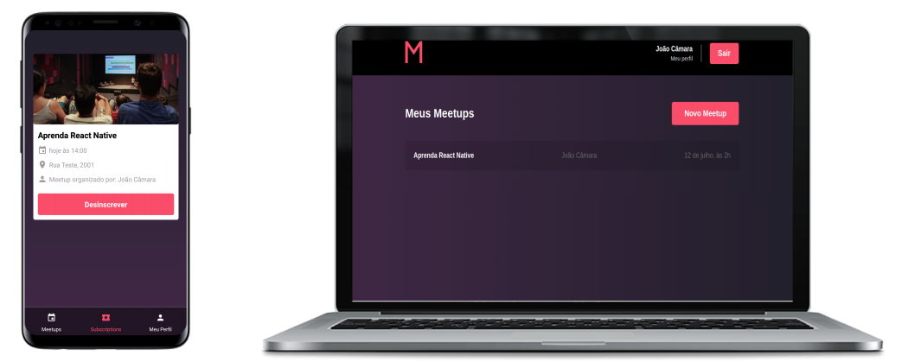

<h1 align="center">
	
</h1>

<h3 align="center">
  <b>Aplicação MeetApp</b>
</h3>

## 👨🏻‍💻 Sobre o projeto 

Organizei o projeto em três repositórios diferentes
**(backend, frontend, mobile)**.

Segue os links

- [Backend](https://github.com/jhonicamara/meetapp-api)
- [Frontend](https://github.com/jhonicamara/meetapp-web)
- [Mobile](https://github.com/jhonicamara/meetapp-mobile)

---

Feito por João Câmara Elias Gabriel 👋 [Veja meu Linkedin](https://www.linkedin.com/in/jo%C3%A3o-c%C3%A2mara-565b42184/)
